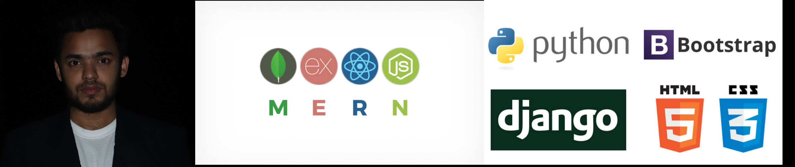

  

### Hi there 👋, I am Piyas
#### MERN Stack Web Developer and Youtuber :)

  

I am Piyas,  I am a full-stack web developer and a Youtuber. I make videos on web development and web designing, so if it sounds interesting check out my
  <a href="https://www.youtube.com/channel/UCq6z3g0J-k0oRFaa9QID5JA">
    youtube channel</a>  

  

  

### Languages and Tools:

 
 
 
---

- 🔭 I’m currently working on Ticket Booking App  
- 🌱 I’m currently learning microservice architecture & video editing :) 
- 💬 Ask me about how to write bugs not code , I am an expert in this :( 
- 📫 How to reach me: https://piyass.com/ 
- ⚡ Fun fact: you don't finish your ongoing project before starting a new one

---

  
  

 

## My Recent Projects -

### Instagrammer Clone
#### Private Detective and Security Firm Website, [Live Site](https://instagrammeclone.web.app/), [Client Repo](https://github.com/piyas1234/instagramme) 

 
- I used React,  Font Awesome icons, Flat Icon ,  . For Backend I used-  Firebase and Heroku server to deploy live server.

 
 

 
